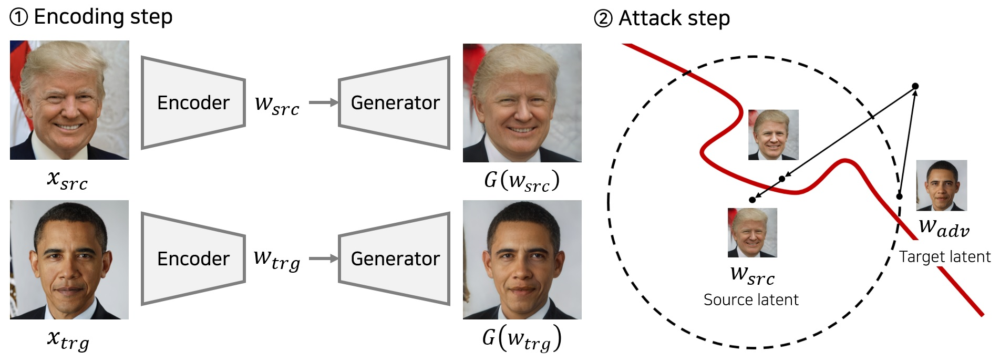
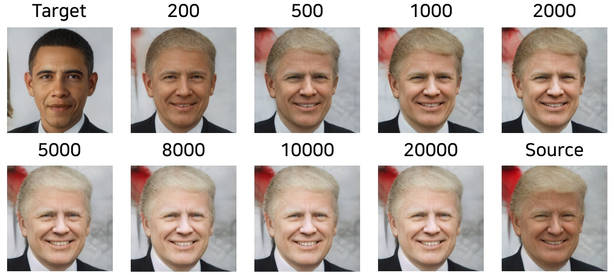

## Latent HSJA

### Unrestricted Black-box Adversarial Attack Using GAN with Limited Queries

* This repository provides official PyTorch implementations for <b>Latent-HSJA</b>.
* This work is presented at [ECCV 2022 Workshop on Adversarial Robustness in the Real World](https://eccv22-arow.github.io/).

### Authors

* [Dongbin Na](https://github.com/ndb796), Sangwoo Ji, Jong Kim
* Pohang University of Science and Technology (POSTECH), Pohang, South Korea

### Abstract

> Adversarial examples are inputs intentionally generated for fooling a deep neural network. Recent studies have proposed unrestricted adversarial attacks that are not norm-constrained. However, the previous unrestricted attack methods still have limitations to fool real-world applications in a black-box setting.
In this paper, we present a novel method for generating unrestricted adversarial examples using GAN where an attacker can only access the top-1 final decision of a classification model. Our method, Latent-HSJA, efficiently leverages the advantages of a decision-based attack in the latent space and successfully manipulates the latent vectors for fooling the classification model.

### Demonstration

### Source Codes

* [HSJA](./attacks/HSJA_for_Facial_Identity_Recognition_Model.ipynb)
* [LatentHSJA (Ours)](./attacks/LatentHSJA_for_Facial_Identity_Recognition_Model.ipynb)

### Datasets

* All datasets are based on the [CelebAMask-HQ](https://github.com/switchablenorms/CelebAMask-HQ) dataset.
    * The original dataset contains 6,217 identities.
    * The original dataset contains 30,000 face images.

#### 1. Celeb-HQ Facial Identity Recognition Dataset

* This dataset is <b>curated</b> for the facial identity classification task.
* There are <b>307 identities</b> (celebrities).
    * Each identity has <b>15 or more</b> images.
* The dataset contains 5,478 images.
    * There are 4,263 train images.
    * There are 1,215 test images.
* [Dataset download link (527MB)](https://postechackr-my.sharepoint.com/:u:/g/personal/dongbinna_postech_ac_kr/ES-jbCNC6mNHhCyR4Nl1QpYBlxVOJ5YiVerhDpzmoS9ezA)

<pre>
<b>Dataset/</b>
    <b>train/</b>
        identity 1/
        identity 2/
        ...
    <b>test/</b>
        identity 1/
        identity 2/
        ...
</pre>

#### 2. Celeb-HQ Face Gender Recognition Dataset

* This dataset is <b>curated</b> for the face gender classification task.
* The dataset contains 30,000 images.
    * There are 23,999 train images.
    * There are 6,001 test images.
* The whole face images are divided into two classes.
    * There are 11,057 <b>male</b> images.
    * There are 18,943 <b>female</b> images.
* [Dataset download link (2.54GB)](https://postechackr-my.sharepoint.com/:u:/g/personal/dongbinna_postech_ac_kr/EZ-LQXHjSztIrv5ayecz_nUBdHRni8ko4p_vCS1zypkhOw)
* [Dataset (1,000 test images version) download link (97MB)](https://postechackr-my.sharepoint.com/:u:/g/personal/dongbinna_postech_ac_kr/ET8NMz2sl2ZEtlUVi5Hs-cIBS9VJhWixX8BM9uC1H1PnPg)

<pre>
<b>Dataset/</b>
    <b>train/</b>
        male/
        female/
    <b>test/</b>
        male/
        female/
</pre>

### Classification Models to Attack

* The size of input images is <b>256 X 256</b> resolution (normalization 0.5).

||Identity recognition|Gender recognition|
|:---|---:|---:|
|MNasNet1.0|78.35% ([code](./classification_models/Facial_Identity_Classification_Using_Transfer_Learning_with_MNASNet_Resolution_256_Normalize_05.ipynb) \| [download](https://postechackr-my.sharepoint.com/:u:/g/personal/dongbinna_postech_ac_kr/EWItNQMfZaVNovgdLgousNwBqhVe5gifzy9plKe4dObTpg))|98.38% ([code](./classification_models/Face_Gender_Classification_Using_Transfer_Learning_with_MNASNet_Resolution_256_Normalize_05.ipynb) \| [download](https://postechackr-my.sharepoint.com/:u:/g/personal/dongbinna_postech_ac_kr/ETr-45CBFQdBpkPU9FJyYi0B_Knk4zRBq0MZ76hiod3bhg))|
|DenseNet121|86.42% ([code](./classification_models/Facial_Identity_Classification_Using_Transfer_Learning_with_DenseNet121_Resolution_256_Normalize_05.ipynb) \| [download](https://postechackr-my.sharepoint.com/:u:/g/personal/dongbinna_postech_ac_kr/EYHdbwJ5xTRCl4l5pJq7FFcBuM7QNJ3ZA1z7dgUP969XNw))|98.15% ([code](./classification_models/Face_Gender_Classification_Using_Transfer_Learning_with_DenseNet121_Resolution_256_Normalize_05.ipynb) \| [download](https://postechackr-my.sharepoint.com/:u:/g/personal/dongbinna_postech_ac_kr/EYb6xTPoB3hNsQhgCCDxMucBrvGwYW2_5_7gdAoHwsm81w))|
|ResNet18|87.82% ([code](./classification_models/Facial_Identity_Classification_Using_Transfer_Learning_with_ResNet18_Resolution_256_Normalize_05.ipynb) \| [download](https://postechackr-my.sharepoint.com/:u:/g/personal/dongbinna_postech_ac_kr/EX15A0wm8MBLrBsT-9ARA-gBZ6W-RwmSw1IgYZzan4dELg))|98.55% ([code](./classification_models/Face_Gender_Classification_Using_Transfer_Learning_with_ResNet18_Resolution_256_Normalize_05.ipynb) \| [download](https://postechackr-my.sharepoint.com/:u:/g/personal/dongbinna_postech_ac_kr/EfvDuXQT285MtP738FodJnQBa8_qF6sW6K2KyAfRzNbiAw))|
|ResNet101|87.98% ([code](./classification_models/Facial_Identity_Classification_Using_Transfer_Learning_with_ResNet101_Resolution_256_Normalize_05.ipynb) \| [download](https://postechackr-my.sharepoint.com/:u:/g/personal/dongbinna_postech_ac_kr/EfSWIIet9s1IjzrCztPrcN0BnVSDMPNH0YPc3U6xC7YiYg))|98.05% ([code](./classification_models/Face_Gender_Classification_Using_Transfer_Learning_with_ResNet101_Resolution_256_Normalize_05.ipynb) \| [download](https://postechackr-my.sharepoint.com/:u:/g/personal/dongbinna_postech_ac_kr/EYVchyAgv5NHvGsXbApEphIBvzgCSWm_o_pk3DzLwuxIug))|

### Generate Datasets for Experiments with Encoding Networks

* For this work, we utilize the [pixel2style2pixel (pSp)](https://github.com/eladrich/pixel2style2pixel) encoder network.
    * E(ꞏ) denotes the pSp encoding method that maps an image into a latent vector.
    * G(ꞏ) is the StyleGAN2 model that generates an image given a latent vector.
    * F(ꞏ) is a classification model that returns a predicted label.
* We can validate the performance of a encoding method given a dataset that contains (image x, label y) pairs.
    * <b>Consistency accuracy</b> denotes the ratio of test images such that F(G(E(x))) = F(x) over all test images.
    * <b>Correctly consistency accuracy</b> denotes the ratio of test images such that F(G(E(x))) = F(x) and F(x) = y over all test images.
* We can generate a dataset in which images are <b>correctly consistent</b>.

||SIM|LPIPS|Consistency acc.|Correctly consistency acc.||
|:---|---:|---:|---:|---:|---:|
|Identity Recognition|0.6465|0.1504|70.78%|67.00%|([code](./inversion_methods/pSp_identity_recognition.ipynb) \| [dataset](https://postechackr-my.sharepoint.com/:u:/g/personal/dongbinna_postech_ac_kr/EQIF7ZqRxDJCjTwWiO1xPe4BqpenC93AEpTnRpSOlrPl5g))|
|Gender Recognition|0.6355|0.1625|98.30%|96.80%|([code](./inversion_methods/pSp_gender_recognition.ipynb) \| [dataset](https://postechackr-my.sharepoint.com/:u:/g/personal/dongbinna_postech_ac_kr/EXjDv_BYbjdIhGvNeM1kYB4BNtpLWYbuCwaQ-JB-ERt8jg))|

### Citation

If this work can be useful for your research, please cite our paper:

<pre>
@inproceedings{na2022unrestricted,
  title={Unrestricted Black-Box Adversarial Attack Using GAN with Limited Queries},
  author={Na, Dongbin and Ji, Sangwoo and Kim, Jong},
  booktitle={European Conference on Computer Vision},
  pages={467--482},
  year={2022},
  organization={Springer}
}
</pre>
